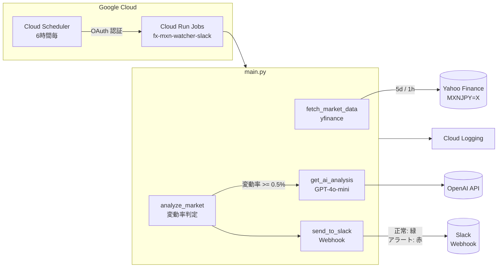

# FX Monitoring Dashboard (Slack 統合版)

[](https://www.python.org/)
[](LICENSE)

MXN/JPY レートを 24 時間監視し、急変動時に AI（OpenAI GPT-4o-mini）が解説を生成、結果を **Slack へリアルタイム通知** する不労所得運用ダッシュボードです。Google Cloud Run Jobs + Cloud Scheduler で自動実行されます。

<!-- TODO: screenshot -->

## このツールで解決する問題

メキシコペソ円のスワップ運用では、コンソールを開いていないと相場急変に気づけません。本 Bot はアラート時に Slack へ即時通知し、スマートフォンでも受け取れるようにします。正常時もハートビート信号を定期送信するため、「Bot が止まっていないか」の確認も同一チャンネルで完結します。

---

## 主な機能

- **MXN/JPY の 24 時間監視**（yfinance 経由）
- **変動率 0.5% 以上で自動アラート**
- **OpenAI GPT-4o-mini による AI 分析**（日本のFXスワップ投資家向けに最適化）
- **Slack へのリアルタイム通知**
  - 正常時: 緑色のハートビート信号（市場安定の確認）
  - アラート時: 赤色の警告メッセージ + AI 解説
- **Cloud Run Jobs + Cloud Scheduler で 6 時間毎自動実行**

---

## 技術スタック

| カテゴリ | 技術 |
|---|---|
| 言語 | Python 3.11+ |
| データ取得 | yfinance |
| AI 分析 | OpenAI GPT-4o-mini |
| 通知 | Slack Incoming Webhooks |
| 実行基盤 | Google Cloud Run Jobs |
| スケジューラ | Google Cloud Scheduler |
| コンテナ | Docker (python:3.11-slim) |

---

## セットアップ手順

### 1. リポジトリのクローン

```bash
git clone https://github.com/tomomira/fx-monitoring-dashboard.git
cd fx-monitoring-dashboard
```

### 2. Python 仮想環境の構築

```powershell
# Windows PowerShell
python -m venv venv
.\venv\Scripts\Activate.ps1
pip install -r requirements.txt
```

```bash
# Linux / macOS / WSL
python -m venv venv
source venv/bin/activate
pip install -r requirements.txt
```

### 3. 環境変数の設定

`.env.example` を参考に、以下の 2 つを設定します:

```powershell
# Windows PowerShell
$env:OPENAI_API_KEY="sk-your-openai-api-key"
$env:SLACK_WEBHOOK_URL="https://hooks.slack.com/services/<WORKSPACE_ID>/<CHANNEL_ID>/<TOKEN>"
```

```bash
# Linux / macOS / WSL
export OPENAI_API_KEY="sk-your-openai-api-key"
export SLACK_WEBHOOK_URL="https://hooks.slack.com/services/<WORKSPACE_ID>/<CHANNEL_ID>/<TOKEN>"
```

> `SLACK_WEBHOOK_URL` 未設定の場合、Slack 通知はスキップされコンソール出力のみになります。

### 4. Slack Webhook URL の取得

1. [Slack](https://slack.com/) で対象ワークスペースにログイン
2. アプリ → 「Incoming Webhooks」を検索 → インストール
3. 通知先チャンネル（例: `#fx-market-alerts`）を選択
4. 発行された Webhook URL を環境変数 `SLACK_WEBHOOK_URL` に設定

### 5. ローカル実行

```powershell
python main.py
```

期待される出力:

```
=== AI FX Market Watcher (MXN/JPY) Started ===
[*] Fetching data for MXNJPY=X...
MXN/JPY Rate: 8.97円 (Change: 0.00%)
✅ 異常なし（安定推移）
[✓] Slack notification sent successfully.
=== End of Process ===
```

---

## GCP へのデプロイ

```bash
# Cloud Run Jobs へデプロイ
gcloud run jobs deploy fx-mxn-watcher-slack \
  --source . \
  --region asia-northeast1

# 環境変数設定
gcloud run jobs update fx-mxn-watcher-slack \
  --set-env-vars OPENAI_API_KEY="<YOUR_KEY>",SLACK_WEBHOOK_URL="<YOUR_WEBHOOK_URL>" \
  --region asia-northeast1

# Cloud Scheduler（6 時間毎実行、OAuth 認証）
PROJECT_ID=$(gcloud config get-value project)
gcloud scheduler jobs create http fx-mxn-watcher-slack-schedule \
  --location=asia-northeast1 \
  --schedule="0 */6 * * *" \
  --time-zone="Asia/Tokyo" \
  --uri="https://asia-northeast1-run.googleapis.com/apis/run.googleapis.com/v1/namespaces/${PROJECT_ID}/jobs/fx-mxn-watcher-slack:run" \
  --http-method=POST \
  --oauth-service-account-email="cloud-scheduler-runner@${PROJECT_ID}.iam.gserviceaccount.com"
```

詳細は [QUICKSTART.md](./QUICKSTART.md) 参照。

> Cloud Run **Jobs** は OAuth 認証が必須（OIDC 不可）。詳細は [docs/internal/トラブルシューティング.md](docs/internal/トラブルシューティング.md) 参照。

---

## アーキテクチャ



---

## Slack 通知の例

### 正常時（ハートビート）

```
✅ 資産運用監視レポート: Normal | MXN/JPY: 8.97円 (+0.12%)
市場は安定推移しています。
```

カラー: 緑（#36a64f）

### アラート時

```
🚨 資産運用監視レポート: ALERT | MXN/JPY: 8.45円 (-0.68%)
MXNJPY=X が 急落（ペソ安） しました！

⚠️ スワップ投資家：含み損拡大の可能性

🤖 AIアナリストのコメント:
メキシコ中央銀行の利下げ示唆を受け、ペソが売られている。
スワップ投資家は維持率の確認が必要だ。短期的には8.40円付近が
サポートラインとなる可能性がある。
```

カラー: 赤（#eb4034）

---

## ディレクトリ構成

```
fx-monitoring-dashboard/
├── main.py                 # メインプログラム（Slack 連携機能含む）
├── requirements.txt        # 依存ライブラリ
├── Dockerfile              # GCP デプロイ用コンテナ定義
├── .env.example            # 環境変数テンプレート
├── .gitignore
├── .gcloudignore           # Cloud Build 除外設定
├── QUICKSTART.md           # クイックスタート手順
├── LICENSE
└── docs/
    └── internal/           # 社内運用ドキュメント（外部読者向けでない）
        ├── README.md
        ├── トラブルシューティング.md
        ├── 進捗_次回作業メモ.md
        └── ID015_AI_FX市場監視Bot_実装・運用手順書_Slack統合版.md
```

---

## 運用コスト

| サービス | 費用 |
|---|---|
| Google Cloud Run Jobs | 無料枠内（月額 ¥0） |
| Google Cloud Scheduler | 無料枠内（月額 ¥0） |
| OpenAI API (GPT-4o-mini) | 月額数十円程度 |
| Slack | 無料プランで利用可能 |

---

## トラブルシューティング要約

| 症状 | 原因 | 対処 |
|---|---|---|
| Slack 通知が届かない | `SLACK_WEBHOOK_URL` 未設定または Webhook 無効 | 環境変数を確認 / 新 URL を発行 |
| Cloud Scheduler が 401 エラー | OIDC 認証を誤って設定 | OAuth 認証で Scheduler を再作成 |
| デプロイ時 WinError 1920 | venv が Cloud Build に混入 | `.gcloudignore` で `venv/` を除外 |
| Scheduler 経由で環境変数が未反映 | キャッシュの問題 | Scheduler を再作成 or 次回自動実行を待つ |

詳細は [docs/internal/トラブルシューティング.md](docs/internal/トラブルシューティング.md) 参照。

---

## 関連プロジェクト

- [ai-market-watchdog-mxn](https://github.com/tomomira/ai-market-watchdog-mxn) — Slack なし版（本プロジェクトのベース）

---

## 解説記事

> 📝 [【統合監視】AI市場監視BotをSlackへ接続せよ。エンジニアのための「不労所得・運用ダッシュボード」構築術](https://note.com/lively_hippo6176/n/n4e8e8e0b30d0)

---

## ライセンス

MIT License — 詳細は [LICENSE](LICENSE) 参照。
